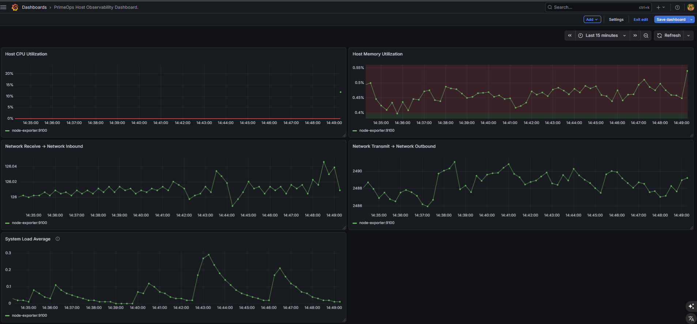
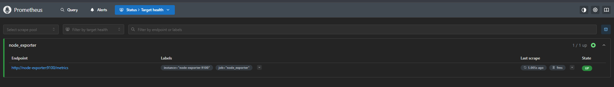
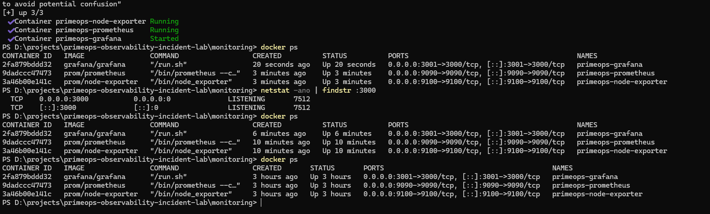

# PrimeOps Observability Incident Lab

A hands-on observability lab designed to simulate infrastructure monitoring and incident investigation using open-source tools.

This project demonstrates how modern monitoring stacks collect, store and visualize infrastructure metrics.

---

# Overview

The lab uses a lightweight monitoring stack built with Docker to simulate a production-like observability environment.

Metrics are collected from a host system and visualized through Grafana dashboards to support operational troubleshooting and incident analysis.

---

# Monitoring Stack

The environment includes:

- **Prometheus** – time-series metrics collection and storage
- **Node Exporter** – host-level metrics exporter
- **Grafana** – visualization and dashboards
- **Docker** – containerized deployment

---

# Monitored Metrics

The dashboard includes the following infrastructure metrics:

- Host CPU utilization
- Host memory utilization
- Network inbound traffic
- Network outbound traffic
- System load

These metrics help detect abnormal system behavior and support incident investigation.

---

# Architecture

Host System
│
▼
Node Exporter
│
▼
Prometheus (scraping metrics)
│
▼
Grafana (dashboard visualization)

Prometheus periodically scrapes metrics exposed by Node Exporter and stores them as time-series data.  
Grafana queries Prometheus and visualizes the metrics through dashboards.

---

# Dashboard Example

Grafana dashboard displaying infrastructure metrics.

---

# Prometheus Targets

Prometheus successfully scraping Node Exporter metrics.

---

# Running Containers

Docker containers used in the monitoring stack.

---

# Project Structure

monitoring/ # Docker compose and Prometheus configuration
dashboards/ # Grafana dashboards
runbooks/ # Incident investigation procedures
scenarios/ # Simulated incident scenarios
evidence/ # Screenshots of the environment
scripts/ # Supporting scripts
docs/ # Documentation

---

# Use Cases

This lab was created to practice:

- infrastructure monitoring
- observability fundamentals
- dashboard creation
- incident investigation
- troubleshooting based on metrics

---

# Future Improvements

Planned improvements for this lab:

- alert rules using Prometheus Alertmanager
- simulated incident scenarios
- automated runbooks
- additional infrastructure metrics

---

# Author

Andre Goncallez  
PrimeOps Project
